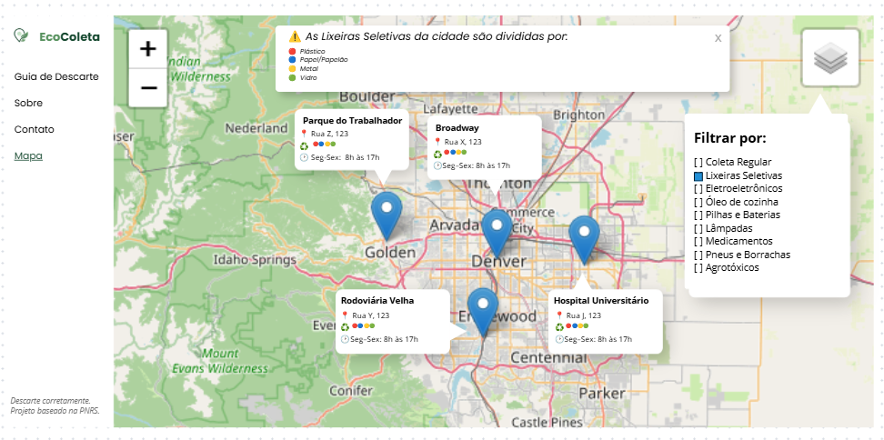
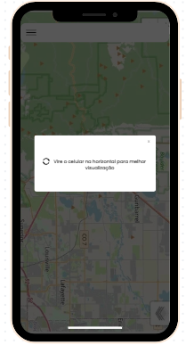
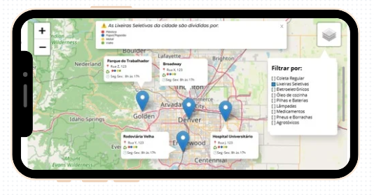

## EcoColeta: Plataforma de Mapeamento de Pontos de Coleta Seletiva


### 🌱Intro
O EcoColeta é uma plataforma web desenvolvida em Python como parte do Projeto Integrador do curso de Análise e Desenvolvimento de Sistemas. A ideia surgiu a partir de um interesse pessoal em criar algo voltado à sustentabilidade, conectando tecnologia e responsabilidade ambiental.

O objetivo do projeto é centralizar informações sobre coleta seletiva e permitir que os usuários encontrem pontos de coleta próximos por meio de um mapa interativo. 

Inspirado em sites de órgãos públicos — simples, informativos e práticos — o EcoColeta busca ser um ambiente acessível, moderno e funcional.


---

###📱Mapa Interativo

##### Desktop


##### Mobile

| Retrato | Paisagem |
|---------|----------|
|  |  |


---

### 🧱 Arquitetura & Refatoramentos

Originalmente em Flask, o projeto foi refatorado para Django, buscando maior escalabilidade, segurança nativa e uma transição futura de dados mockados para persistência real via Django ORM e admin nativo.

O CSS puro também foi migrado para Bootstrap 5 (via CDN por enquanto), priorizando agilidade para focar no ponto crítico do projeto: o mapa interativo.

#### 📂Diretório
A arquitetura anterior de diretórios permanece a mesma, de Apps do Django, mantendo a clareza e facilidade de manutenção. 

```bash
projeto-eco-coleta/
│
├── config/                  # Configurações do projeto Django (settings, urls)
│
├── core/                    # App principal da aplicação
│   ├── siteinfos.py         # Mock temporário de dados (classes dos cards/banners)
│   ├── views.py             # Lógica de controle e renderização (Contextos)
│   ├── urls.py              # Rotas específicas do app core
│   └── templates/           # Templates HTML estruturados para o Django DTL
│       └── partials/        # Componentes reutilizáveis
│           └── footer.html     
│           └── navbar.html
│       ├── base.html
│       ├── index.html
│       ├── como_funciona.html
│       ├── mapa.html
│       ├── contato.html
│       └── materiais.
│
├── docs/images/
|   ├── mapa-desktop.png
|   ├── mapa-mobile-retrato.png
|   └── mapa-mobile-paisagem.png
|
├── static/                  # Arquivos estáticos globais (CSS, JS, Imagens)
│   ├── css/
│   │   └── style.css
│   └── img/   
│   └── js/
│   │   └── mapa.js

```

#### ✅Boas Práticas Aplicadas

* Conventional Commits: Histórico do Git padronizado (feat:, fix:, chore:, docs:).
* DRY (Don't Repeat Yourself): Reutilização de blocos estruturais de dados globais (como o Footer e a navbar) injetados via contexto nas Views.
* Clean Code: Nomes significativos, funções enxutas e eliminação de código morto/legado do Flask (app.py).
* Acessibilidade & HTML Semântico: Estruturação com tags semânticas (`<ol>`, `<li>`, `<aside>`, `<section>`), atributos de acessibilidade (aria-label) e rótulos vinculados explicitamente a cada campo (`<label for="...">`).

##### Separação de Responsabilidades

* **`core/views.py`** → Gerencia as requisições, injetando os objetos de dados necessários em um dicionário de contexto direcionado aos templates.
* **`core/siteinfos.py`** → Centraliza as classes estruturais (`Banner`, `Secao`, `CardSecao`, `FooterDivs`) mapeando os dados do ecossistema de forma limpa.
* **Templates (Django Template Language - DTL)** → Responsáveis estritamente pela camada de apresentação, utilizando tags nativas do Django (``, ``, ``) de forma rígida e performática, eliminando chamadas diretas de funções do Python no HTML.


#### Tecnologias Utilizadas

* Python 3.12
* Django 6.1
* HTML5
* CSS3
* Bootstrap 5


---

###📍Roadmap

O desenvolvimento do EcoColeta está estruturado em fases incrementais, focando na transição de dados controlados para uma aplicação dinâmica real:


 #### 1. Identidade Visual & Páginas Secundárias
  - [x] Página de Contato
  - [x] Página do Mapa
  - [x] CSS Global & Responsividade
#### 2. Integração do Mapa interativo
  - [x] Consumo via JS (Leaflet.js)
  - [ ] Endpoint JSON
#### 3. Banco de Dados & Persistência
  - [ ] Migração para Django Models
  - [ ] Modelagem dos Pontos de Coleta
  - [ ] Migrations & Django Admin
#### 4. Ambiente de Produção & PostgreSQL
  - [ ] Integração com PostgreSQL
  - [ ] Ajustes para Deploy

---

### ⚙️Como executar localmente

1. **Clone o Repositório:**
   ```bash
   git clone https://github.com/rafaela-barbosa/projeto-eco-coleta.git
   cd projeto-eco-coleta
2. **Crie e Ative o Ambiente Virtual:**
   ```bash
   python -m venv venv
   .\venv\Scripts\activate   # No Windows PowerShell/CMD
    source venv/bin/activate # No Linux / MacOS
3. **Instale as Dependencias:**
   ```bash
   pip install -r requirements.txt
4. **Rode as Migrações Iniciais:**
   ```bash
   python manage.py migrate
5. **Execute a Aplicação:**
   ```bash
   python manage.py runserver
O projeto estará acessível em http://127.0.0.1:8000/.

---

### 📚Reflexão & Aprendizado

A migração de arquitetura do Flask para o Django expandiu drasticamente minha percepção sobre o desenvolvimento web comercial. Lidar com as restrições e o ecossistema do Django exigiu um aprofundamento em ciclos de requisição/resposta e boas práticas de acoplamento de código.

Espero que o EcoColeta se torne uma ferramenta útil de verdade, onde as pessoas possam procurar pontos de coleta próximos e indicar novos locais, ajudando na construção de cidades mais conscientes e sustentáveis. 

